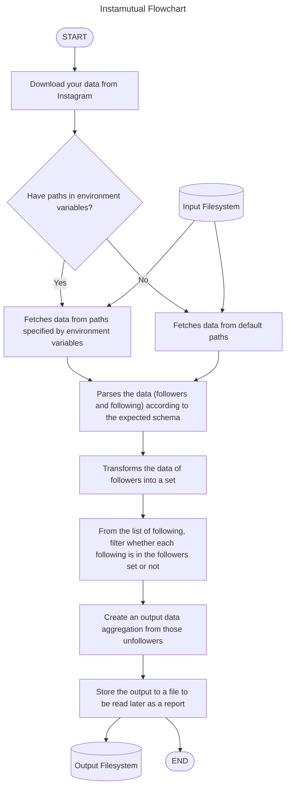

# Instamutual

Node.js command-line tool to find out people who do not follow you back on Instagram. This repository does not use any third-party libraries or unofficial APIs and will just purely use your own downloaded data (per your own request) as they are without modifying anything at all.

## Introduction

Instagram does not really provide a way for you to check if someone does not follow you back by itself. You have to do that manually. This tool helps you to do that, so you can identify who has unfollowed you and how you should act or retaliate against that action. This is a problem that has been here for a while (couple of years). Recently, Instagram has released "Download Data" feature, and one of the options is to download the data as JSON, which makes this problem easy to solve because of its compatibility with various programming languages.

## Requirements

- [Node.js LTS](https://nodejs.org/)
- [Yarn 1.22+](https://yarnpkg.com/)

You can also use `npm` if you want to. Replace all `yarn` occurences with `npm`.

## Flowchart



## Usage

- First and foremost, please clone this repository on your local computer.

```bash
git clone git@github.com:lauslim12/instamutual.git
```

- Install all required dependencies.

```bash
# If you're using yarn
yarn

# If you're using npm
npm install
```

- The next step is on you. You have to download your data on Instagram. Steps to do this on the mobile application are:

  - Click your profile.
  - Click the hamburger menu on the top right.
  - Click `Your activity`.
  - Scroll down to the bottom, and click on `Download your information`.
  - Click `Request a download`.
  - Click `Select types of information`.
  - Select `Followers and following` and then click `Next`.
  - In the `Format` section, change it to `JSON` and change the `Date range` to `All time`.
  - Optionally, you can set `Media quality` to `High` (it doesn't really matter).
  - Click `Submit request` and wait for Instagram to reply to your request. They should get back to you via email.
  - Download your data from the link that Instagram gave you. You should get a `.zip` file.

- After getting your data from Instagram, you have to move the data to this repository:

  - Unzip the downloaded `.zip` file.
  - You will get a folder titled `followers_and_following`, and there should be a file named `followers_1.json` and `following.json`. The name may be different, but it should be pretty straightforward to get your data from there.
  - Move both files to `input` folder in your cloned repository.

- If the filename is different, you can optionally customize it via environment variables. The defaults provided are `followers_1.json` and `following.json` at the moment if you do not fill these environment variables. You can also optionally modify the output filename (now it is `output.json`) if you wish.

```bash
# UNIX
export FOLLOWING_FILENAME=YOUR_FILENAME_TO_FOLLOWING
export FOLLOWERS_FILENAME=YOUR_FILENAME_TO_FOLLOWERS
export OUTPUT_FILENAME=YOUR_OUTPUT_FILENAME

# Windows
set FOLLOWING_FILENAME=YOUR_FILENAME_TO_FOLLOWING
set FOLLOWERS_FILENAME=YOUR_FILENAME_TO_FOLLOWERS
set OUTPUT_FILENAME=YOUR_OUTPUT_FILENAME
```

- After your setup is done, you can run the script by using the following command:

```bash
yarn start
```

- Done! The output will be placed in the `out` folder. It will either be `output.json` or your chosen filename!

- You have to do this once in a while (download your data and do all of the steps again) to stay updated on your unfollowers.

## Tests

So far, this program does not have tests yet. Contributions are very welcome.

## Contributing

If you want to contribute, please create an issue or a pull request. Do not forget to run `yarn lint` in order to keep the code in unified standards. All ESLint and Prettier configurations are embedded inside `package.json` for practicality. We are using ESLint's TypeScript Recommended style with Prettier.

## License

Project is licensed under MIT License.
